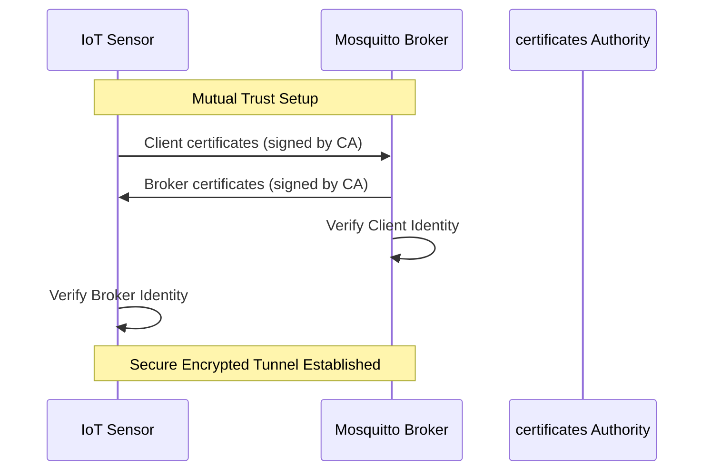

# Secure MQTT TLS: Hardened Connectivity Lab

## Overview
This laboratory explores the implementation of robust security patterns within the MQTT protocol, specifically focusing on **Mutual TLS (mTLS)** to prevent unauthorized asset access and data interception.

## Security Architecture
The system moves beyond simple authentication to a full certificate-based trust chain:

### mTLS Handshake Flow

## Key Implementations
*   **mTLS Encryption**: Full payload encryption using X.509 certificates.
*   **Mutual Authentication**: Two-way verification ensuring only trusted sensors can publish to the industrial broker.
*   **Last Will and Testament (LWT)**: Automated status alerts published by the broker if a sensor experiences an ungraceful disconnect.

## Project Structure
*   **certificates/**: X.509 trust chain (Root CA, Broker, and Client certs).
*   **secure-sensor.py**: Python client implementing SSL/TLS context and LWT logic.
*   **reports/**: Technical analysis and security audit documentation.

---
*Developed for the IoT Module - Mundiapolis University.*

Authored by Youssef Fellah.  
Developed for the Engineering Cycle - Mundiapolis University.
