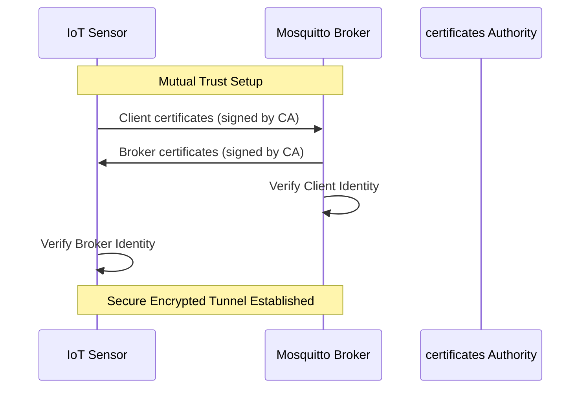

# Secure MQTT TLS hardened connectivity lab

This laboratory explores the implementation of robust security patterns within
the MQTT protocol. The primary focus is on Mutual TLS (mTLS) to prevent
unauthorized asset access and data interception.

## Security architecture

The system implements a full certificate-based trust chain, moving beyond
simple authentication.

### mTLS handshake flow

## Key implementations

- mTLS encryption: Provides full payload encryption using X.509 certificates.
- Mutual authentication: Implements two-way verification to ensure only trusted
  sensors can publish to the industrial broker.
- Last Will and Testament (LWT): Automates status alerts published by the
  broker if a sensor experiences an ungraceful disconnect.

## Project structure

- `certificates/`: Contains the X.509 trust chain, including Root CA, broker,
  and client certificates.
- `secure-sensor.py`: A Python client that implements SSL/TLS context and LWT
  logic.
- `reports/`: Technical analysis and security audit documentation.

Authored by Youssef Fellah.
Developed for the Engineering Cycle at Mundiapolis University.
