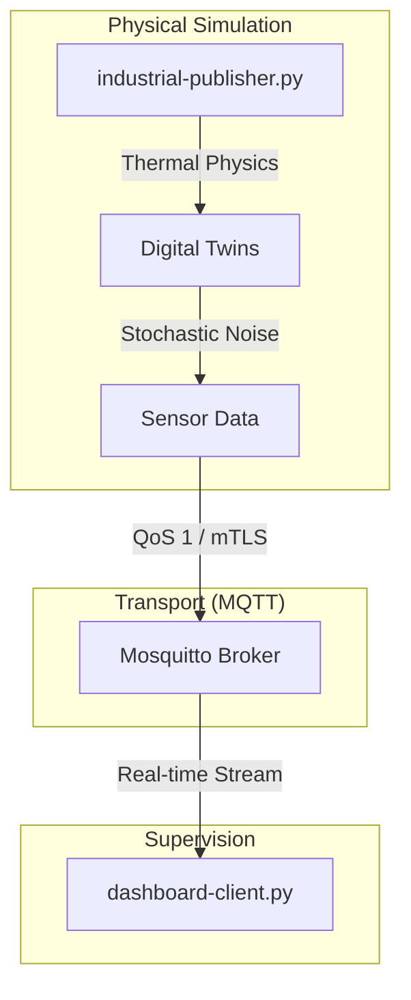

# Industrial digital twin: CNC telemetry and thermal modeling

This project is an Industry 4.0 simulation designed to bridge physical physics
modeling with secure cloud telemetry. It implements a multi-threaded engine to
orchestrate digital twins of industrial assets.

## System architecture

## Core implementations

### 1. Physics-based modeling

- Thermal dynamics: Mathematical modeling of spindle temperature as a function
  of rotational speed (RPM) and friction over time.
- Environmental simulation: Stochastic modeling using Gaussian noise to
  simulate real-world atmospheric data fluctuations.

### 2. Reliable messaging (QoS 1)

- Message persistence: Implementation of acknowledgment handshakes to ensure
  critical spindle overheat alerts survive network failures.
- Decoupled pub/sub: Multi-threaded architecture that ensures the physical
  engine remains non-blocking during network latency.

## Project structure

- `industrial-publisher.py`: Multi-threaded simulation engine for industrial
  assets.
- `dashboard-client.py`: Real-time telemetry consumer and visualizer.
- `sensor-sim.py`: Core physics-based digital twin definitions.

Authored by Youssef Fellah.
Developed for professional Industrial IoT research.
