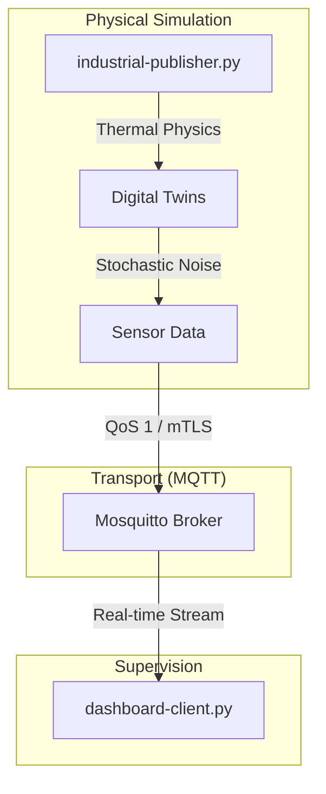

# Industrial Digital Twin: CNC Telemetry & Thermal Modeling

## Overview
A high-performance Industry 4.0 simulation engineered to bridge the gap between physical physics modeling and secure cloud telemetry. This project implements a multi-threaded engine to orchestrate Digital Twins of industrial assets.

## System Architecture

## Core Implementations

### 1. Physics-Based Modeling
*   **Thermal Dynamics**: Mathematical modeling of spindle temperature as a function of rotational speed ($RPM$) and friction over time.
*   **Environmental Simulation**: Stochastic modeling using Gaussian noise to simulate real-world atmospheric data fluctuations.

### 2. Reliable Messaging (QoS 1)
*   **Message Persistence**: Implementation of acknowledgment handshakes to ensure critical spindle overheat alerts survive transient network failures.
*   **Decoupled Pub/Sub**: Multi-threaded architecture ensuring the physical engine remains non-blocking during network latency.

## Project Structure
*   **industrial-publisher.py**: Multi-threaded simulation engine for industrial assets.
*   **dashboard-client.py**: Real-time telemetry consumer and visualizer.
*   **sensor-sim.py**: Core physics-based Digital Twin definitions.

---
*Developed during professional Industrial IoT deep-dive.*
